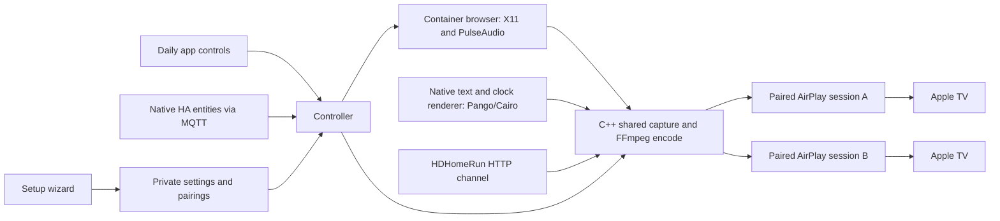

# Architecture

HDHomeRun input uses one HTTP connection. The demuxer fills separate compressed
audio/video queues (at most 256 packets and 8 MiB each); each decoder paces its
own track against the common input timestamp origin. This prevents video waits
from blocking audio further down the transport stream. Queues apply backpressure
and are not an additional playback-delay setting. Incomplete mid-stream joins
recover at the next usable sequence header; sustained loss of either track
fails and releases the input. Stop interrupts reads, pacing and queue waits.

The AirPlay event socket carries unsolicited messages and may stay quiet.
Short cancellable polls wait for an event without an idle-expiration policy;
once data arrives, the existing bounded framing and authenticated decryption
still apply. Regular control-channel feedback remains the session heartbeat.

The Python control service owns configuration, authenticated ingress, browser
lifecycle, lineup metadata and MQTT discovery. It starts one C++ process per
active source. C++ links directly to libavdevice, libavformat, libavcodec,
libavfilter, libswscale and libswresample. It does not invoke an FFmpeg subprocess.

Video is letterboxed to the configured canvas, optionally deinterlaced, converted
to limited-range YUV, and encoded as H.264 without B frames. Browser video and
PulseAudio input timestamps are mapped to a shared epoch. Channel audio/video
preserve their relative presentation timestamps from one demuxer. Stereo PCM is
resampled to 44.1 kHz and wrapped in lossless 352-sample ALAC escape frames
before encrypted RTP delivery. This adds four framing bytes and no extra delay. Presentation
lead is configurable in Setup. Bounded audio timestamp gaps are filled with
silence, and overlaps are trimmed; jumps of two seconds or more stop the source.
This preserves the common timeline when a capture device skips silent samples.

Encoded frames are immutable shared objects, not one encode per TV. Each receiver
has a bounded queue, a separately verified pairing, its own stream key/counters,
and its own timing/control ports. A slow or disconnected TV cannot grow an
unbounded queue or block other TVs. Video uses the negotiated type-110 TCP data
stream. Audio uses type-96 UDP, synchronization packets and bounded recovery of
recent ciphertext. Stop sends TEARDOWN and closes the sender's resources.

Before changing sources, the controller warms the new source. Failure preserves
the previous stream. Stop can cancel source warmup. Commands never auto-play on
startup, reconnect or Home Assistant discovery. MQTT retained commands are ignored.
Receiver disconnects require an explicit retry; this release does not continually
re-pair or reconnect.

## Private boundaries

- Host networking allows LAN mDNS and HDHomeRun broadcast discovery. A bridged
  container does not forward this discovery traffic onto the LAN.
- The production UI binds only to Supervisor's internal bridge address on its
  assigned ingress port, and accepts only the ingress proxy as the caller.
  Engine and VNC listeners allocate loopback ports; Xvfb chooses an unused
  display. X11 TCP is disabled and PulseAudio uses a private UNIX socket.
- UDP 18200–18215 supplies receiver timing and audio recovery during playback.
- The container uses `SYS_ADMIN` to allow Chrome's nested sandbox namespaces,
  as required by this container runtime. This is a broad Linux capability;
  Home Assistant Protection mode and Chrome's sandbox remain enabled. The
  browser runs as UID 1000 and receives no Supervisor/MQTT credentials.
- The container has its own browser profile and display, no host filesystem
  mounts and no access to Home Assistant configuration files.
- Browser URLs may point to LAN services; access is for authenticated HA admins.
  Protect browser accounts and back up the app as private data.
- Root-owned settings and pairing files are mode 0600; the browser cannot read
  them. PINs are not stored. Pairings verify the receiver's pinned identity.
- Chrome has no remote debugging endpoint or automation flags. A per-install
  signed Linux extension uses a private native-messaging socket. Its only page
  permission is `https://www.youtube.com/*`; there is no debugger, cookies,
  broad tabs or account-page permission. Navigation uses ordinary Chrome APIs.
- Native paste briefly serves UTF-8 text on the private X11 clipboard, waits for the
  receiving application to read it, lets the paste event settle, and closes the owner. Text is never an argv,
  file or log entry. VNC selection exchange is disabled, and preview input is
  held while paste is delivered to the owned Chrome window.
- VNC has a private session password. The service authenticates the loopback
  VNC connection and bridges it through an ingress-authorized WebSocket with an
  expiring one-use ticket. The browser tab never receives the VNC password.
- No credentials, private URLs, page text or raw child logs are printed. Known
  generic browser startup failures and media counters are available for diagnosis.

## Generated source lifecycle

The native renderer uses bounded plain UTF-8 text, measured wrapping, a selected
IANA time zone and monotonic elapsed time. Preview calls the same renderer. Warmup
produces a valid encoded picture without starting the duration. The first receiver
subscription starts the shared countdown and forces an IDR; the last picture is
allowed to reach its buffered presentation time before sessions tear down. A
normal completion returns Idle rather than a source error. Old process events
cannot end a replacement stream. Generated sources never start audio capture.
